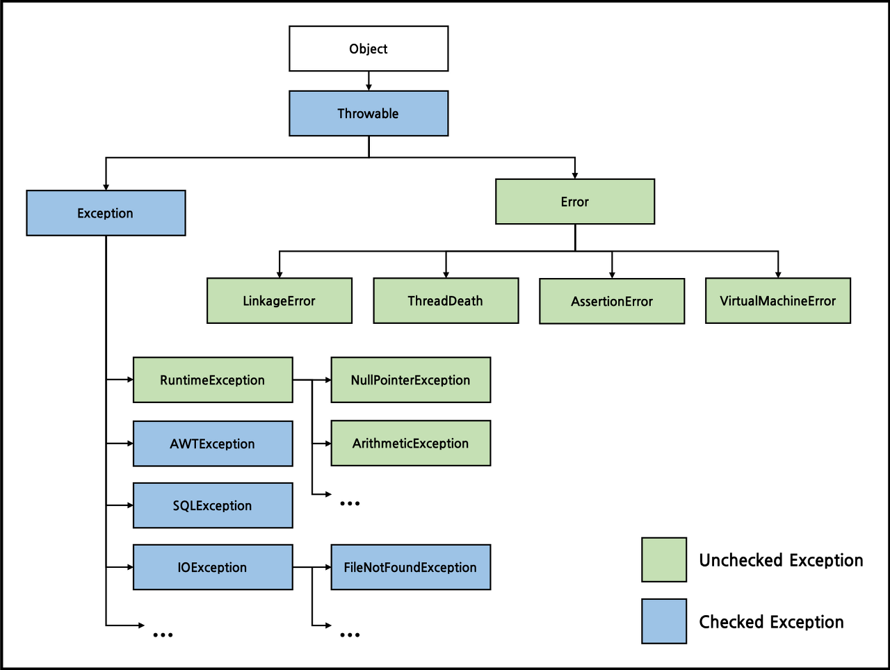
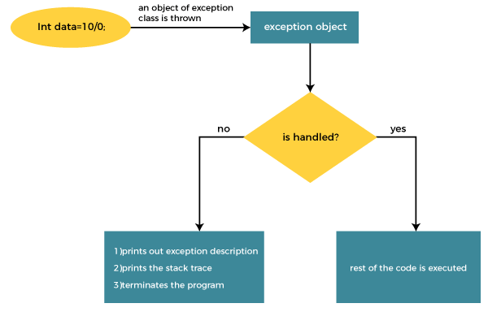
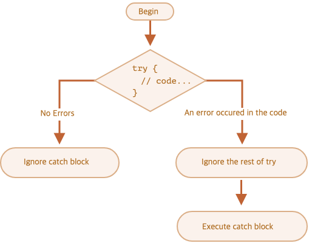

## 목표

자바의 예외 처리에 대해 학습하세요.

## 학습 내용

### 들어가기 앞서...

프로그램에서 비정상적인 행동이 일어나는 것을 `error` 라고 하고   
그 `error` 발생시 행동요령 등 을 설정 해 주는 것을 `예외처리` 라고한다   

`error` 는 크게 3가지 종류로 나뉜다   

1. compiler   
	컴파일 단계
2. runtime   
	프로그램 실행 도중
3. logical   
	의도와 다르게 동작   


자바의 Exception class 는 다음과 같은 구조로 이루어져 있다  
  
 

Throwable 단계에서 해당 오류에 대한 대처 유무에 따라 나뉜다

- Errors		- 대처불가능   
	메모리 부족, 오버플로우와 같이 비정상적인 종료를 피할 수 없는 error
- Exceptions	- 대처가능   
	프로그램 코드 내에서 예측하고 대처 가능한 error



<details>

<summary> * 자바에서 예외 처리 방법 (try, catch, throw, throws, finally) </summary>

#### try - catch

(예제)
```java
	try {
		// 예외가 발생할 가능성
	} catch (Exception1 e1) { // (처리하고자 하는 에러)
		// Exception1 발생시 행동요령
	} catch (Exception2 e2)
		...
```
동작 원리는 다음과 같다   


1. 예외가 발생하는 문장이 try 블럭에 존재한다   
	없으면 탈출
2. 발생한 예외에 해당하는 클래스의 인스턴스가 만들어진다   
3. catch 블럭의 참조변수의 자료형과 만들어진 인스턴스를 instanceof 연산자로 비교하며 찾는다   
4. 찾으면 해당 catch 블록을 실행한다   
5. 못찾으면 JVM 에게 모든걸 맡긴다   

추가적으로 호출 정보와 예외 메세지를 출력 함 으로서 해당 프로그램이 try-catch 를 거쳤는지 확인 할 수 있다   

(예제)
```java
try {
        System.out.print(3);
        System.out.print(0 / 0); // 예외가 발생
        System.out.print(4); // 실행되지 않는다.
    }	
	catch (ArithmeticException e) { // 참조변수에서 해당 에러를 찾음
        e.printStackTrace(); // 호출 스택에 대한 정보를 받아옴
        System.out.println("예외 메세지 :" e.getMessage()); // 에러를 출력
    }
```

(*❗* {} 생략 x, 동일한 참조변수 사용 x, 1.7 부터 | 기호 사용 가능)  

#### throw, throws

- throw   
	고의적으로 예외를 발생시키는 키워드
```java
class Main {
    public static void main(String args[]) {
        try {
            Exception e = new Exception("my exception\n");
            throw e;
        } catch (Exception e) {
            System.out.println("catch" + e.getMessage() + "\n");
            e.printStackTrace();
        }
        System.out.println("program close\n");
    }
}
```
```bash
java.lang.Exception: my exception

at Main.main(Main.java:4)
program close
```

- throws   
	메소드에 예외를 선언하여 책임을 선언한 곳에서 지게 하는 키워드
```java
void method() throws Exception{
	// 메서드 내용
}
```

throws 의 경우 해당 메소드를 선언한 클래스를 선언한 클래스까지    
Exception 이 최종적으로 선언한 클래스까지 전달된다   

#### finally

finally 블럭은 예외의 발생여부에 상관없이 실행되야할 코드를 포함시킬 목적으로 사용된다   
try-catch문의 끝에 선택적으로 덧붙여 사용할 수 있다   

구성과 실행 순서로는

- 구성
	try-catch-finally

- 실행   
	예외 발생시 try-catch-finally   
	예외 미발생시 try-finally   

```java
try {
	// 예외가 발생할 가능성이 있는 code
} catch (Exception1 e1) {
	// 예외에 따른 행동 요령
} finally {
	// 일단 실행되는 code
}
```

#### [자동 자원 반환(try-with-resources)]

try-catch 문의 변형으로   
주로 입출력에 사용되는 클래스 중에서는 사용 후 꼭 닫아주어야 한다   
하지만 finally 블럭에 close() 를 하려면 그에 따른 예외 처리를 위해   
추가적인 try-catch 문이 들어가 가독성이 떨어지는데, 그 부분을 해결하기 위해 
try 블럭의 () 안에 리소스를 선언시 자동으로 close()를 해주는 식으로 나왔다     

(try-catch)
```java
try{
	fis = new FileInputStream("score.dat");
    dis = new DataInputStream(fis);
		...
} catch (IOException ie) {
	ie.printStackTrace();
} finally {
	try {
		if(dis!=null)
        	dis.close();
    } catch(IOexception ie) {
      	ie. printStachTrace();
    }
}
```

(try-with-resources)
```java
try (FileInputStream fis = new fileInputStream("score.dat");
	 DataInputStream dis = new DatainputStream(fis)) {
     while(true) {
     	score = dis.readInt();
        System.out.println(score);
        sum += score;
     }
} catch (EOFException e) {
	System.out.println("점수의 총합은" + sum +"입니다.");
} catch (IOException ie) {
	ie.printStackTrace();
}
```

#### 사용자 정의 예외

우리는 우리만의 예외 처리가 필요할 때가 있다   
예를 들어 우리가 서비스를 할 때, 사용자의 정보를 받아오는 과정에서   
전화번호를 받는다고 가정했을 때, 입력받은 해당 데이터의 정보가 유효한지 검증하는   
우리만의 예외처리를 해야 하는 것이다   

```java
// Exception 을 상속받는 커스텀 전화번호 예외 클래스 생성
public class InvalidPhoneNumberException extends Exception {
	// Exception 클래스의 생성자를 호출하여 메세지 설정
	public InvalidPhoneNumberException(String message) { 
		super(message);
	}
}
```

</details>
<details>

<summary> * 자바가 제공하는 예외 계층 구조 </summary>


[공식문서](https://docs.oracle.com/javase/8/docs/api/java/lang/Exception.html)

</details>
<details>

<summary> * Exception과 Error의 차이는? </summary>

- Errors		- 대처불가능   
	메모리 부족, 오버플로우와 같이 비정상적인 종료를 피할 수 없는 error   
- Exceptions	- 대처가능   
	프로그램 코드 내에서 예측하고 대처 가능한 error   

</details>
<details>

<summary> * RuntimeException과 RE가 아닌 것의 차이는? </summary>

RuntimeException 의 경우는 말 그대로 Runtime 도중 일어나는 예외 처리를 의미한다   
그 외의 경우로는   
Checked Exception 이라고 하는 컴파일러 단계에서 확인하는 예외 처리로 코드에서 명시적으로 처리하는데 RuntimeException 와 대조되며   
RuntimeException 를 Unchecked exception 이라고도 한다   

</details>
<details>

<summary> * 커스텀한 예외 만드는 방법 </summary>

```java
// Exception 을 상속받는 커스텀 전화번호 예외 클래스 생성
public class InvalidPhoneNumberException extends Exception {
	// Exception 클래스의 생성자를 호출하여 메세지 설정
	public InvalidPhoneNumberException(String message) { 
		super(message);
	}
}
```

</details>

## 질문

1. try-with-resource에서 자원을 사용하는 예시가 무엇이 있나요?

[예시](#자동-자원-반환try-with-resources)

2. 예외처리 전략에 대해 알려주세요.

- 커스텀 예외를 만들 때 어떤 상황에서 Unchecked를 써야하고 어떤 상황에서 Checked를 써야하나요?
- Checked 예외는 반드시 try-catch문을 사용해서 "처리"해야한다고 하는데, 처리한다는 것이 정확하게 어떤 행위(혹은 코드)를 의미하나요? 예외처리하는 방법에 대해 알려주세요

```
만일 클라이언트가 발생한 예외로부터 복구를 할 수 있다면 Checked
							복구 할 수 없다면 Unchecked

```
[oracle](https://docs.oracle.com/javase/tutorial/essential/exceptions/runtime.html)
```
Checked 예외는 컴파일러 단계에서 강제로 처리하기때문에 가만히 냅두먼 컴파일 자체가 되지 않는다   
그렇기에 해당 예외가 발생했을시 그에 맞는 행동요령을 할 수 있는 try-catch 문을 사용하는 것다
```

3. e.printStackTrace()가 무엇인가요?

throwable 과 그 backtrace 를 표준 에러 스트림으로 출력
즉, 예외가 발생한 위치와 예외를 발생시킨 메서드 호출 스택을 출력하는 메서드
[오라클](https://docs.oracle.com/javase/8/docs/api/java/lang/Throwable.html#printStackTrace--)

4. 예외처리를 그냥 로직으로 사용하지 않고, Exception을 사용하는 이유는 뭔가요?

예를 들어 c언어에서는 open() 함수로 파일을 열고 반환값을 사용하여 정상적으로 파일이 열린 것인지 확인을 하는데,
java에서는 File클래스를 사용하면 IOException을 throw하는 것으로 확인을 합니다.
어떤 장점이 있어서 이런 방법을 채택한 것인가요?

	1. 가독성   
		예외처리 코드를 일반 코드와 분리
		호출 스택을 통해 역방향으로 검색가능
		오류 유형을 그룹화 하고 구별

5. Exception을 계속 throw 하다보면 결국 메인까지 올텐데, 그마저도 throw하면 어떻게 처리하는지 궁금합니다.

JVM 에게 모든 책임이 전가되고 JVM 에서 알아서 처리한다
