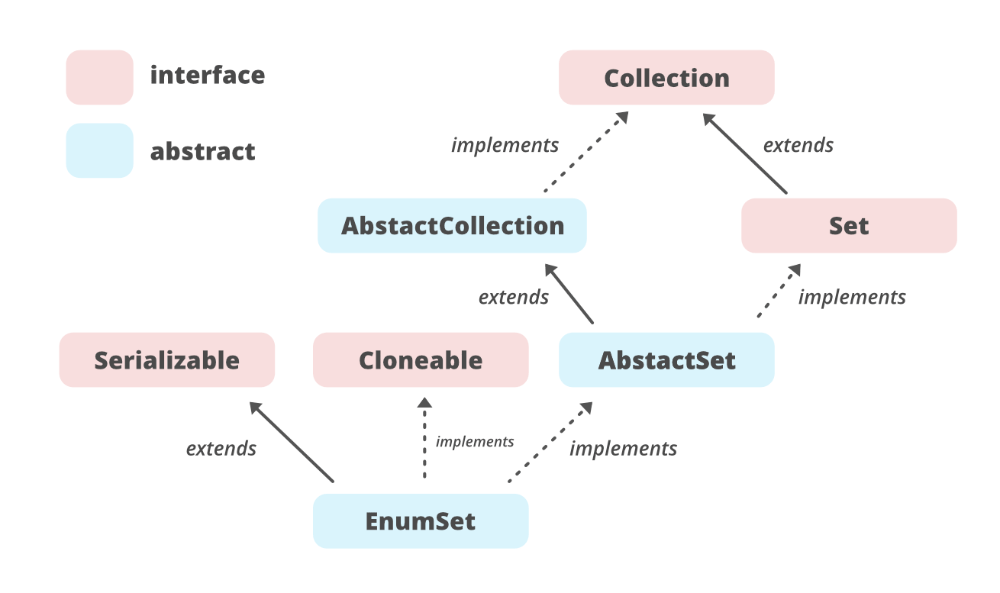

# 자바 스프링 6회차

## Enum이란

enum(열거형)은 서로 관련된 상수를 편리하게 선언하기 위한 것

상수를 여러개 정의할 때 사용(ex : 과일의 apple과 기업 apple)

`apple기업에서 생산한 당도 1등급의 apple은 비싸다` 

boolean 자료형의 true, false도 열거형

## enum 정의하는 방법

```java
public enum Language { // 0부터 연속적인 정수값이 부여됨
    C, JAVA, KOTLIN, JAVASCRIPT
}
열거형 필드의 이름은 상수이기 때문에, 대문자로 표기된다.

컴파일 후 바이트코드에서는
class Hamburger
{
     public static final Hamburger BIGMAC = new Hamburger();
     public static final Hamburger SHANGHI = new Hamburger();
     public static final Hamburger MACCHICKEN = new Hamburger();
}
로 정의된다.
열거형 상수의 비교는 == 와 compartTo()만 사용 가능
why? 클래스끼리는 비교연산자가 안되니까.

// 내부적으로 불연속적인 값을 주기 위하여 생성자를 만들어 값을 받아온 후, 인스턴스 변수에 저장하는 방식이다.
enum Day {
    SUNDAY(1), MONDAY(5), TUESDAY(0), WEDNESDAY(2), THURSDAY(6), FRIDAY(3), SATURDAY(4); 
    Day(int value) { this.value = value; } // 항상 접근제어자는 private 이다.

    private final int value; // 정수를 저장할 인스턴스 변수를 추가해준다.
    public int value() { return value; }
}
```

```jsx
public enum Operation {
    PLUS, MINUS, MULTIPLY, DIVIDE;

    int eval(int x, int y) {
        switch (this) {
            case PLUS:      return x + y;
            case MINUS:     return x - y;
            case MULTIPLY:  return x * y;
            case DIVIDE:    return x / y;
        }
        throw new AssertionError("연산 오류" + this);
    }
}

class Some {
    public static void main(String[] args) {
        int result = Operation.PLUS.eval(1, 2);
        System.out.println(result);
    }
}
위처럼 enum type은 스위치 문으로 사용할 수 있다.
```

```java
// 어떤 객체의 지구에서의 무게를 입력받아 여덞 행성에서의 무게를 출력하는 예제이다.
enum Planet { // 질량, 반지름
    MERCURY(3.302e+23, 2.439e6),
    VENUS  (4.869e+24, 6.052e6),
    EARTH  (5.975e+24, 6.378e6),
    MARS   (6.419e+23, 3.393e6),
    JUPITER(1.899e+27, 7.149e7),
    SATURN (5.685e+26, 6.027e7),
    URANUS (8.683e+25, 2.556e7),
    NEPTUNE(1.024e+26, 2.477e7);

    private final double mass;           
    private final double radius;         
    private final double surfaceGravity;

    // 중력상수
    private static final double G = 6.67300E-11;

    // 생성자
    Planet(double mass, double radius) { //enum에 저장된 질량과 반지름으로 중력 계산
        this.mass = mass;
        this.radius = radius;
        surfaceGravity = G * mass / (radius * radius);
    }

		//getter 메서드
    public double mass()           { return mass; }
    public double radius()         { return radius; }
    public double surfaceGravity() { return surfaceGravity; }

    public double surfaceWeight(double mass) { // 중력으로 mass값을 연산
        return mass * surfaceGravity;
    }
}

double mass = 70.0;
double weightOnMars = Planet.MARS.surfaceWeight(mass);
위처럼 데이터와 생성자와 메서드가 있는 enum도 구현 가능하다.
```

## enum이 제공하는 메소드 (values()와 valueOf())

| 메서드(T는 타입, E는 Element) | 설명 |
| --- | --- |
| Class getDeclaringClass() | 열거형의 Class객체를 반환 |
| String name() | 열거형 상수의 이름을 문자열로 반환 |
| int ordinal() | 열거형 상수가 정의된 순서를 반환(0부터 시작) |
| T valueOf(Class enumType, String name) | 지정된 열거형에서 name과 일치하는 열거형 상수를 반환 |
| compareTo(E o) | 지정된 객체보다 작은 경우 음의 정수, 동일한 경우 0, 크면 양의정수를 반환 |

그 밖에 clone(), equals(), finalize(), toString(), hashCode() 메소드들도 있는데 이는 Object 클래스로부터 상속받은 메소드이다.

values()를 제외한 나머지는 java.lang.Enum 클래스에 정의된 메서드이다.

values는 모든 열거형이 가지고 있는 특징으로, 컴파일러가 자동으로 추가해준다.

Ordinal() 메서드는 Enum 내부에서 사용하기 위해 만든 것으로 프로그래머가 실제로 사용하지 않는다.

## java.lang.Enum

모든 열거형은 Enum클래스를 상속받기 때문에, enum 타입은 상속을 받을 수 없다.

toString을 제외한 대부분의 메서드는 final로 선언되어 있기 때문에, 오버라이딩 할 수 없다.

## EnumSet

열거형을 위해 고안된 Set 인터페이스 구현체이다.

HashSet보다 성능상의 이점이 많다.

