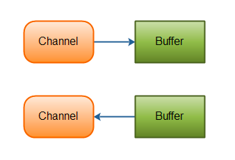

## [목표](#목표)
## [학습 내용](#학습-내용)
- [스트림 (Stream) / 버퍼 (Buffer) / 채널 (Channel) 기반의 I/O](#스트림-stream--버퍼-buffer--채널-channel-기반의-io)
    - [스트림](#스트림-stream)
    - [버퍼](#버퍼-buffer)
    - [채널](#채널-channel)
## [InputStream과 OutputStream](#inputstream과-outputstream)
## [Byte와 Character 스트림](#byte와-character-스트림)
## [표준 스트림](#표준-스트림-systemin-systemout-systemerr)
- [system.in](#systemin)
- [system.out](#systemout)
- [system.err](#systemerr)
## [파일 읽고 쓰기](#파일-읽고-쓰기)


# [목표]

자바의 Input과 Ontput에 대해 학습하세요.

# [학습 내용]

## [스트림 (Stream) / 버퍼 (Buffer) / 채널 (Channel) 기반의 I/O]   

### [스트림 (Stream)]   

스트림 은 `바이트의 연속` 그렇기에 이론상 스트림은 무한의 값을 가진다   
한번 지나간 스트림은 다시 되돌아 갈 수 없으며 다시 동일한 요소를 방문하려면 새로 생성해야 한다   

스트림은 한 번만 작동해야한다, 스트림이 재사용되면 `IllegalStateException` 를 throw 한다   
하지만 어떠한 작업에서는 해당 스트림 재사용을 감지 할 수 없어 주의해야 한다   

자동 리소스 관리의 기능으로 대부분의 스트림을 자동으로 닫아주기에
거의 모든 스트림 인스턴스는 사용 후 실제로 닫을 필요가 없다   
(일반적으로 소스가 `Channel I/O` 인 스트림만 닫아야 한다)   

계산을 수행하기 위해 스트림 작업은 스트림 파이프라인 으로 구성되어 있다   
또한 스트림은 매우 게으르기 파일을 계속해서 읽어들이면서 작업을 수행하는 것이 아닌,   
최종 연산이 호출 될때 작업을 시작한다   

[stream 출처](#https://www.javatpoint.com/java-8-stream)
	
### [버퍼 (Buffer)]   

   

버퍼는 어떤 유형의 연속적인 메모리 블록으로 정의될 수 있다   
버퍼는 파일 또는 데이터가 스트림으로 읽히는 소스의 데이터 스트림을 저장하는데 사용되는 메모리 블록이다   
버퍼는 입출력 데이터를 한번에 모아 처리하는 방식으로 시스템 자원을 효율적으로 사용 할 수 있다는데에 의의가 있다   
기존의 입력 방식은 문자열 "ABCDE" 를 입력 하게되면 "A"를 입력하고 바로 처리하고 "B"를 입력하고 바로 처리하는 방식이다   
그렇기에 데이터를 덮어 씌워지게되며 "ABCDE" 가 아닌 "E" 가 마지막으로 저장되어 있게 된다   
하지만 버퍼를 사용하게 되면 "A" 를 입력하고 버퍼에 저장하고 "B"를 입력받아 다시 "A" 옆에 저장하고   
최종적으로 "ABCDE" 를 저장하게 되고 이후에 처리하게 된다   
이러한 과정을 `Stream data` 가 `single solid value` 로 변하는 과정이라고 한다 
이렇게 버퍼에 저장된 데이터를 readLine() 메서드를 사용하여 한줄씩 읽어들이게 되면
버퍼에 저장된 전체 데이터를 한번에 가져와 변수에 저장하는 식으로 시스템 자원을 효율적으로 사용 할 수 있다   

### [채널 (Channel)]     


I/O 작업을 위한 가장 중요한 연결고리   
`NIO (New I/O)` 패키지에서 제공하는 채널은 스트림과 달리 양방향으로 작동한다   
또한 기존의 I/O 와 다르게 Non-blocking I/O 를 지원한다   
**! )** 하지만 언제나 Non-blocking I/O 로 작동하지는 않는다   
버퍼를 반드시 사용해야 하며, 채널은 버퍼를 통해 데이터를 읽고 쓴다



가장 대표적인 구현은 다음과 같다    

파일에서 데이터를 읽는 `FileChannel`   
UDP 를 통해 데이터를 읽고 쓰는 `DatagramChannel`
TCP 를 통해 데이터를 읽고 쓰는 `SocketChannel`

## [InputStream과 OutputStream]   


InputStream과 OutputStream은 추상 클래스로서, 이를 상속받아 구현한 클래스들이 많다   

## [Byte와 Character 스트림]   

- Byte Stream : 바이트 단위로 데이터를 입출력하는 스트림   
  8비트 바이트의 단위로 데이터를 전송한다   
  **! )** 정상적인 프로그램처럼 보이나 실제로는 피해야 할 일종의 저수준 I/O 로 문자 스트림을 사용하는것이 낫다   
    그렇다면 왜 바이트 스트림에 대해 알아야 하는가?   
    그 이유로는 단순하게도 다른 모든 스트림 유형이 바이트 스트림을 기반으로 구축되기 때문이다   
  
  아래는 바이트 스트림의 작동원리를 보여주는 그림이다
     
  

- Character Stream : 문자 단위로 데이터를 입출력하는 스트림   
  특이하게도 바이트 스트림 대신 문자 스트림을 사용하면 자동으로 문자 인코딩 변환을 처리해준다   


## [표준 스트림 (System.in, System.out, System.err)]   

- System.in : 키보드로부터 입력을 받는 스트림
- System.out : 콘솔에 출력하는 스트림
- System.err : 콘솔에 에러를 출력하는 스트림

사용예제   

```java
import java.io.InputStream;
import java.util.Scanner;

public class Main {
	public static void main(String[] args) {
		InputStream is = System.in;
		Scanner scanner = new Scanner(is);

		System.out.println("System.in : ");
		String line = scanner.nextLine();
		if (line != null && !line.isEmpty()) {
			System.out.println("System.out : " + line);
		} else {
			System.err.println("System.err : No input found!");
		}
		scanner.close();
	}
}
```
## [파일 읽고 쓰기]   

   
파일 I/O 메서드를 복잡도별로 정렬한 내용

```java
import java.io.*;
import java.nio.file.Files;
import java.nio.file.Path;
import java.util.Scanner;

public class Main {
  public static void main(String[] args) throws Exception {
    Path file = Path.of("./Java/README.md"); // 파일 경로
    try (InputStream in = Files.newInputStream(file)) { // 파일 열어서 스트림 생성
      BufferedReader reader = new BufferedReader(new InputStreamReader(in)); // 파일 읽기
      String line = null; // 초기화
      while ((line = reader.readLine()) != null) { // 파일 끝까지 읽기
        System.out.println(line); // 파일 내용 출력
      }
    } catch (IOException x) { // 예외 처리
      System.err.println(x); 
    }
  }
}
```

[출처](#https://docs.oracle.com/javase/tutorial/essential/io/file.html#textfiles)
[NIO](#https://openjdk.org/projects/nio/)